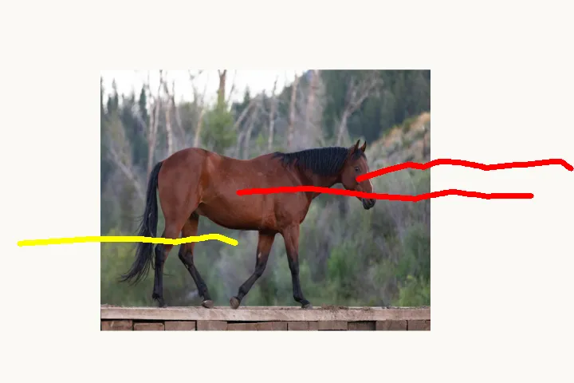
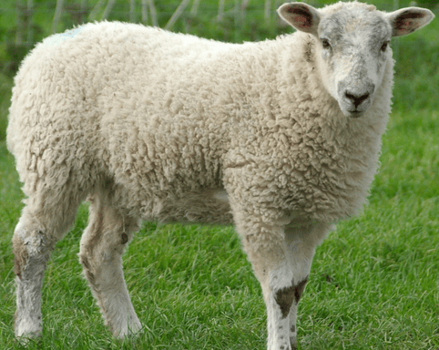

<p align="center">
    
</p>


# Frame In-N-Out: Unbounded Controllable Image-to-Video Generation (NeurIPS 2025)

<div align="center">

[](https://arxiv.org/abs/2505.21491)
[](https://uva-computer-vision-lab.github.io/Frame-In-N-Out/)
<a href="https://huggingface.co/spaces/HikariDawn/FrameINO"></a>
<a href="https://huggingface.co/collections/uva-cv-lab/frame-in-n-out"></a>

</div>


We propose Frame In-N-Out, a controllable Image-to-Video generation Diffusion Transformer model where objects can enter or exit the scene along user-specified motion trajectories and ID reference. Our method introduces a new dataset curation pattern recognition, evaluation protocol, and a **motion-controllable**, **identity-preserving**, **unbounded canvas** Video Diffusion Transformer, to achieve Frame In and Frame Out in the cinematic domain.


🔥 [Update](#Update) **|** 👀 [**Visualization**](#Visualization)  **|** 🔧 [Installation](#installation) **|** ⚡ [Test](#fast_inference)  **|** 🤗 [Model Zoo](#model_zoo) **|** 🧩 [Dataset Curation](#dataset_curation)  **|** 🔥[Train](#training)  **|** 💻 [evaluation](#evaluation)


## <a name="Update"></a> Update 🔥🔥🔥
- [x] Release the paper
- [x] Release the paper weights (CogVideoX-5B Stage1 Motion + Stage2 Motion with In-N-Out capbility)
- [x] Release the improved model weights (Wan2.2-5B on higher resolution, more datasets, and improved curation)
- [x] Gradio App demo 
- [x] Release the Evaluation Code and Metrics
- [x] Release the Training Code with a short sample dataset
- [x] Release Arbitrary Resolution-trained Wan2.2 weights, denoted as V1.6
- [x] HF Space Demo
- [x] Release the Pre-Processing Code

:star: **If you like Frame In-N-Out, please help ⭐⭐star⭐⭐ this repo. Thanks!** :hugs:


## <a name="Visualization"></a> Brief Intro Video 👀
---

https://github.com/user-attachments/assets/0fabd2a4-9d3b-4148-bc04-6fc03c53caca

---


**Wan2.2-5B on Frame In-N-Out:**
<table style="width: 100%; border-collapse: collapse; text-align: center; border: 1px solid #ccc;">
  <tr>
    <th style="text-align: center;">
      <strong>Visual Canvas</strong>
    </th>
    <th style="text-align: center;">
      <strong>ID Reference</strong>
    </th>
    <th style="text-align: center;">
      <strong>Wan2.2-based Frame In-N-Out (v1.5)</strong>
    </th>
  </tr>

  <tr>
    <td style="text-align: center; vertical-align: middle;">
      
    </td>
    <td style="text-align: center; vertical-align: middle;">
      
    </td>
    <td style="text-align: center; vertical-align: middle;">
      
    </td>
  </tr>

  <tr>
    <td style="text-align: center; vertical-align: middle;">
      
    </td>
    <td style="text-align: center; vertical-align: middle;">
      
    </td>
    <td style="text-align: center; vertical-align: middle;">
      
    </td>
  </tr>

</table>


## <a name="installation"></a> Installation 🔧
```shell
conda create -n FINO python=3.10
conda activate FINO
pip install torch==2.5.1 torchvision==0.20.1 torchaudio==2.5.1 --index-url https://download.pytorch.org/whl/cu124
conda install ffmpeg
pip install -r requirements.txt
```


## <a name="fast_inference"></a> Fast Inference ⚡⚡⚡
Gradio Interactive demo is available by 
```shell
python app.py
```

The Gradio Demo online is available [here](https://huggingface.co/spaces/HikariDawn/FrameINO). 
This will cost 21GB of memory on average (peak: 26GB) with the enable_model_cpu_offload (but slightly slower). 
We will create a folder that starts with **tmp_app_example_** in your local folder. There, you could find all conditions (including segmented ID and the padded generation result in the full canvas).

NOTE: This will automatically download pretrained weights to the HF cache and use our released [**Frame In-N-Out V1.6 on Wan2.2-5B**](https://huggingface.co/uva-cv-lab/FrameINO_Wan2.2_5B_Stage2_MotionINO_v1.6) weight by default, which supports arbitrary resolution better compared to V1.5 version.

NOTE: We recommend to open **Running on public URL** choice, which is more stable compared to the local URL option.


## <a name="model_zoo"></a> Model Zoo 🤗

We provide two forms of weight for Frame In-N-Out. The first one is what we used in our paper, CogVideoX-I2V-5B. 
Meanwhile, this summer, we see the Wan2.2-TI2V-5B, which is also applicable for full finetune in A100. Thus, we do some modifications to their architecture and training process and then introduce it here. Training code is released.

For the v1.5 version, we curate the dataset again, by optimizing the scene cut selection mechanism (leave more cases instead of directly filtering out), replacing CUT3R with SpatialTrackerV2 (SOTA 3D camera estimation model), a strong motion filtering mechanism, a clear start detection, and more small changes. Meanwhile, we discard the Webvid dataset in the training (which has a watermark) and introduce partial [OpenS2V](https://huggingface.co/datasets/BestWishYsh/OpenS2V-5M) in the training.

| Model                                                          | Description                    | Huggingface                                                                                     |
|--------------------------------------------------------------- | -------------------------------| ------------------------------------------------------------------------------------------------| 
| CogVideoX-I2V-5B  (Stage 1 - Motion Control)                   |  Paper Weight v1.0             |     [Download](https://huggingface.co/uva-cv-lab/FrameINO_CogVideoX_Stage1_Motion_v1.0)         |
| CogVideoX-I2V-5B  (Stage 2 - Motion + In-N-Out Control)        |  Paper Weight v1.0             |     [Download](https://huggingface.co/uva-cv-lab/FrameINO_CogVideoX_Stage2_MotionINO_v1.0)      |
| Wan2.2-TI2V-5B  (Stage 1 - Motion Control)                     |  New Weight v1.5 on 704P       |     [Download](https://huggingface.co/uva-cv-lab/FrameINO_Wan2.2_5B_Stage1_Motion_v1.5)         |
| Wan2.2-TI2V-5B  (Stage 2 - Motion + In-N-Out Control)          |  New Weight v1.5 on 704P       |     [Download](https://huggingface.co/uva-cv-lab/FrameINO_Wan2.2_5B_Stage2_MotionINO_v1.5)      |
| Wan2.2-TI2V-5B  (Stage 2 - Motion + In-N-Out Control)          |  New Weight v1.6 on Arbitrary Resolution |     [Download](https://huggingface.co/uva-cv-lab/FrameINO_Wan2.2_5B_Stage2_MotionINO_v1.6)      |


## <a name="dataset_curation"></a> Dataset Curation 🧩

The preprocessing code is located in the `preprocess/` subdirectory.
<br>

For a small quick **mini**-dataset (demo training dataset), you can download by: 
```shell
# Recommend to set --local-dir as FrameINO_data, which is the default fixed dir in most files
hf download uva-cv-lab/FrameINO_data --repo-type dataset --local-dir FrameINO_data
```

This dataset includes 300 train videos and the corresponding csv label files (text prompt, motion traj, filtering criteria) for data loading (as well as 20 videos for validation in training). 
The evaluation dataset for both Frame In and Frame Out benchmark can be found inside here.

**NOTE**: Please log in to our [huggingface page](https://huggingface.co/datasets/uva-cv-lab/FrameINO_data) and agree to the Gated Access.


## <a name="training"></a> Train 🔥 

Though we provide a short sample training dataset (~300 videos), the full dataset needs to be prepared by yourself. 
This is just for illustration and as an example.

The training is slightly different on the dataloader part from what is stated in the paper. 
We also modified and trained a Wan2.2-5B version. 
This is because we found that WAN2.2-5B might be an interesting model and we spent quite a lot of time after the submission to optimize the training and, more importantly, curation stage. We prefer the version presented below and will be based on this.


### Stage1 Motion Training 

For Wan2.2-5B:
```shell
# 1 GPU
python train_code/train_wan_motion.py

# 4GPU (Our experiment Setting). Change the XXXXX to your port (like 32214)
accelerate launch --config_file config/accelerate_config_4GPU.json --main_process_port XXXXX train_code/train_wan_motion.py
```

For CogVideoX:
```shell
# 1 GPU
python train_code/train_cogvideox_motion.py

# 4GPU (Our experiment Setting).  Change the XXXXX to your port (like 32214)
accelerate launch --config_file config/accelerate_config_4GPU.json --main_process_port XXXXX train_code/train_cogvideox_motion.py
```

Use **--use_8BitAdam True** for 8Bit Adam (based on your hardware support)


### Stage2 Frame In-N-Out Training (Motion + Unbounded Canvas + ID reference)

For Wan2.2-5B:
```shell
# 1 GPU
python train_code/train_wan_motion_FrameINO.py    

# 4GPU (Our experiment Setting).  Change the XXXXX to your port (like 32214)
accelerate launch --config_file config/accelerate_config_4GPU.json --main_process_port XXXXX train_code/train_wan_motion_FrameINO.py
```


For CogVideoX:
```shell
# 1 GPU
python train_code/train_cogvideox_motion_FrameINO.py    

# 4GPU (Our Experiment Setting).  Change the XXXXX to your port (like 32214)
accelerate launch --config_file config/accelerate_config_4GPU.json --main_process_port XXXXX train_code/train_cogvideox_motion_FrameINO.py
```

Use **--use_8BitAdam True** for 8Bit Adam (based on your hardware support)


## <a name="evaluation"></a> Evaluation 💻

The evaluation dataloader is slightly different from the training version before. 
The dataloader we use in this stage is based on our paper setting (using the v1.0 paper weight at the same time). 
The evaluation dataset can be downlaoded from [huggingface page](https://huggingface.co/datasets/uva-cv-lab/FrameINO_data), same HF you used from [Dataset Curation](#dataset_curation) section above.


For Frame In:
```shell
python test_code/run_cogvideox_FrameIn_mass_evaluation.py
```
Please check **Frequently Changed Setting** inside the code to double-check if your setting is aligned (like the pre-trained model path and the evaluation dataset).
 
For Frame Out:
```shell
python test_code/run_cogvideox_FrameOut_mass_evaluation.py
```
Please check **Frequently Changed Setting** inside the code to double-check if your setting is aligned (like the pre-trained model path and the evaluation dataset).

For the evaluation metrics, we provide our modified version of Traj Error, Video Segmentation on Mean Absolute Error, Relative DINO matching, and VLM-judged In-N-Out success rate.
Check **evaluation/mass_evalution.py** and then modify the setting there (like the number of frames, path, metrics for Frame In/Out) based on the needs.


## Disclaimer
This project is released for academic use only. We disclaim responsibility for the distribution of the model weight and sample data. Users are solely liable for their actions. The project contributors are not legally affiliated with, nor accountable for, users' behaviors.


## 📚 Citation
```bibtex
@article{wang2025frame,
  title={Frame In-N-Out: Unbounded Controllable Image-to-Video Generation},
  author={Wang, Boyang and Chen, Xuweiyi and Gadelha, Matheus and Cheng, Zezhou},
  journal={arXiv preprint arXiv:2505.21491},
  year={2025}
}
```

## 🤗 Acknowledgment
The current version of **Frame In-N-Out** is built on [diffusers](https://github.com/huggingface/diffusers).
We appreciate the authors for sharing their awesome codebase.
